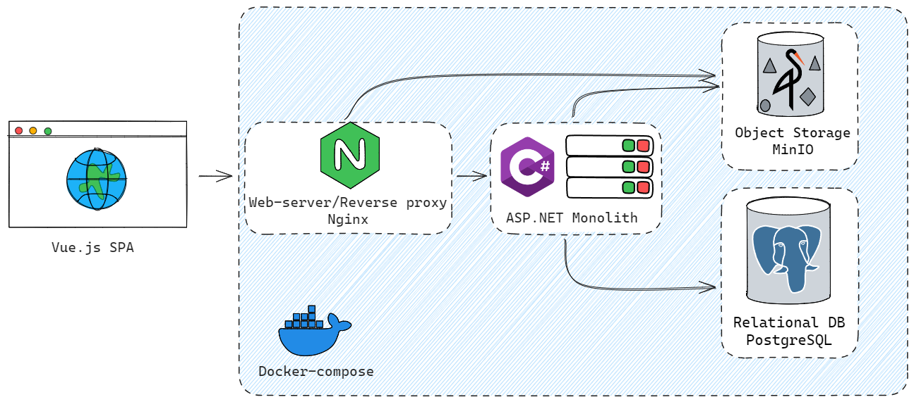

# OurTube.backend

## Введение

Далее будет приведено описание технической составляющей проекта, выводы касательно проделанной работы можете прочитать
по [ссылке](backend_review.md)

## Api и функционал

В данном проекте было реализовано API, предоставляющее весь базовый функционал видеохостинга, а именно:

- Регистрация и авторизация пользователей
- Загрузка и просмотр видео
- Комментарии к видео
- Плейлисты
- Реакции (лайки/дизлайки) для видео и комментариев
- История просмотров
- Рекомендации

Подробнее ознакомиться с Api вы можете по ссылке [OpenApi](https://balalaikajun.github.io/OurTube/).

## Стек технологий

При разработке были использованы следующие инструменты:

- **ASP.NET 9.0**:
    - **AspNetCore.Identity** - авторизация, аутентификация и т.д.
    - **EntityFramework Core** - ORM
    - **AutoMapper** - маппинг
    - **MediatR** - работа с событиями
    - **Minio SDK** - SDK для работы с Minio
    - **MailKit** - работа с электронной почтой
    - **Xabe.FFmpeg** - работа с FFmpeg
- **PostgreSQL** - база данных
- **Minio** - хранилище файлов
- **FFmpeg** - обработка видео
- **Nginx** - веб-сервер, обратный прокси
- **Docker/Docker Compose** - развёртывание
- **Git/GitHub** - система контроля версий
- **VisualStudio/JetBrains Rider, Webstorm** - IDE

## Архитектура

Приложение состоит из SPA фронтенда на Vue.js, который раздаётся Nginx и через него же проксирует API-запросы
к бэкенду. Бэкенд — монолит, по чистой архитектуре на ASP.NET — реализует всю бизнес-логику, аутентификацию и работу с
данными: структурные
данные хранятся в PostgreSQL, файлы и blob — в MinIO (S3-совместимое объектное хранилище). Всё запускается через
docker-compose для удобного развёртывания.

### Сервер

Проект сервера представляет собой обычный монолит, построенный с использованием принципов чистой архитектуры, где
каждый слой выделен в отдельный проект.
На рисунке изображены пространства имён разбитые по слоям-проектам.

В таблице приведено описание пространств имён из схемы

| Название                  | Описание содержимого                                                             |
|---------------------------|----------------------------------------------------------------------------------|
| Controllers               | Контроллеры приложения, обрабатывающие запросы                                   |
| Middlewares               | Middleware – обработчики запросов, срабатывающие между их принятием и обработкой |
| Attributes                | Кастомные атрибуты                                                               |
| Utils                     | Прочий код для настройки Api                                                     |
| Interfaces (Application)  | Контракты приложения (Интерфейсы)                                                |
| Services (Application)    | Сервисы – сборники различного функционала                                        |
| Requests                  | Запросы для Api / Сервисов                                                       |
| Replies                   | Ответы Api / Сервисов                                                            |
| Mappings                  | Конфигурации маппинга                                                            |
| Handlers                  | Обработчики ивентов для библиотеки MediatR                                       |
| Extensions                | Методы расширения для выполнения различных работ                                 |
| Validators                | Логика валидации (проверки) данных                                               |
| Entities                  | Сущности, описывающие предметную область приложения                              |
| Interfaces (Domain)       | Контракты для сущностей                                                          |
| Events                    | Доменные ивенты MediatR                                                          |
| Exceptions                | Кастомные исключения                                                             |
| Services (Infrastructure) | Сервисы, работающие с внешними элементами                                        |
| Data                      | Настройки ORM                                                                    |
| Migrations                | Миграции EntityFramework                                                         |

### База данных

На рисунке изображена схема базы данных

В таблице приведён перечень таблиц и их назначение

| Название                                                                                                           | Описание содержимого                                                                                     |
|--------------------------------------------------------------------------------------------------------------------|----------------------------------------------------------------------------------------------------------|
| ApplicationUser                                                                                                    | Таблица, содержащая данные пользователя, необходимые для работы бизнес-логики приложения                 |
| Subscriptions                                                                                                      | Подписки пользователей                                                                                   |
| UserAvatar                                                                                                         | Данные об аватарах и их расположении в хранилище                                                         |
| Videos                                                                                                             | Метаданные видео, необходимые для работы логики приложения                                               |
| VideoSource                                                                                                        | Данные об исходниках видео и их расположении в хранилище                                                 |
| VideoPreview                                                                                                       | Данные о превью-изображениях видео и их расположении в хранилище                                         |
| VideoPlaylist                                                                                                      | Данные о плейлистах формата `.m3u8`, необходимых для работы стандарта HLS, и их расположении в хранилище |
| Tags                                                                                                               | Список тегов, существующих в системе                                                                     |
| VideoTags                                                                                                          | Связь «многие-ко-многим» между видео и тегами                                                            |
| VideoVotes                                                                                                         | Данные о реакциях пользователя на видео (лайк/дизлайк)                                                   |
| VideoView                                                                                                          | История просмотров                                                                                       |
| Playlists                                                                                                          | Данные о пользовательских плейлистах                                                                     |
| PlaylistElements                                                                                                   | Связь «многие-ко-многим» между плейлистами пользователей и видео                                         |
| Comments                                                                                                           | Комментарии пользователей                                                                                |
| CommentVotes                                                                                                       | Реакции на комментарии                                                                                   |
| IdentityUser, AspNetUserClaims, AspNetUserLogins, AspNetUserTokens, AspNetUserRoles, AspNetRoleClaims, AspNetRoles | Таблицы для работы библиотеки ASP.NET Identity                                                           |
| __EFMigrationsHistory                                                                                              | Системная таблица EF Core                                                                                |

### Хранилище файлов

В таблице приведена структура путей в хранилище

| Описание            | Bucket | Путь                                                |
|---------------------|--------|-----------------------------------------------------|
| Исходник видео      | videos | `{GUID-Видео}/source.mp4`                           |
| Превью изображение  | videos | `{GUID-Видео}/preview.jpg`                          |
| Плейлист HLS        | videos | `{GUID-Видео}/{Resolution}/playlist.m3u8`           |
| Сегмент HLS         | videos | `{GUID-Видео}/{Resolution}/segments/segment_{№}.ts` |
| Аватар пользователя | users  | `{UserId}/avatar.jpg`                               |

### Обработка видео

Обработка видео в нынешней версии делается синхронно, во время запроса, при помощи ffmpeg.

FFmpeg — набор свободных библиотек с открытым исходным кодом, которые позволяют записывать, конвертировать и передавать
цифровые аудио- и видеозаписи в различных форматах.

Видео транскодируются под различные параметры и нарезаются на фрагменты формата hls, впоследствии загружается в
хранилище.

## Развёртывание

Развёртывание приложения производиться через docker-compose.
Выделен базовый файл с развёртыванием общих элементов, а так же дополнения под различные варианты окружения.
Так же каждый вариант окружения зависит от своего файла переменных окружения.

Для корректной работы шифрования cookies и токенов ключи DataProtection должны храниться в устойчивом хранилище.